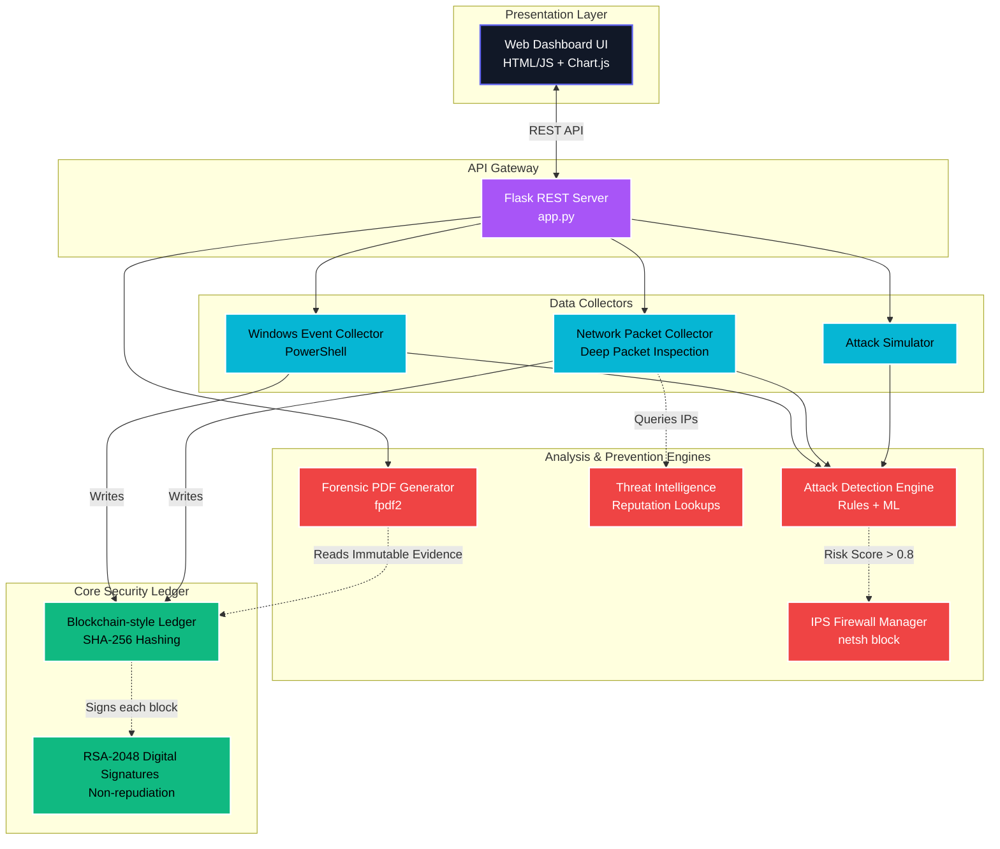

# Secure Log Collection & Forensic Analysis System Architecture

This document provides a high-level overview of the architecture and data flow for the Secure Log Collection and Forensic Analysis System v2.0.

## System Components

The system is built upon several core modules that work together to collect, analyze, secure, and respond to threats in real-time.

## Module Descriptions

### 1. Presentation Layer (`templates/index.html`)
- **Dashboard UI**: A custom-designed dark-mode interface utilizing Vanilla JS and CSS variables for a premium aesthetic. It heavily leverages `Chart.js` to render the Threat Activity Doughnut chart and the Risk Analysis Timeline.
- **Client-side Interactivity**: The UI polls the Flask API (`/api/status` and `/api/logs`) every 2 seconds to update statistics, the activity feed, and dynamically render newly secured log blocks without refreshing the page.

### 2. API Gateway (`app.py`)
- The central controller handling RESTful endpoints for starting/stopping the collection, retrieving system stats, verifying the integrity of the blockchain, triggering simulated attacks, and requesting forensic evidence reports.

### 3. Data Collectors
- **`RealLogCollector` (`secure_logger/real_collector.py`)**: Initiates asynchronous PowerShell subprocesses to extract `Application`, `System`, and `Security` event logs directly from Windows Event Viewer, as well as `Get-Process` telemetry for resource thresholds.
- **`NetworkCollector` (`secure_logger/network_collector.py`)**: Uses Deep Packet Inspection (DPI) to analyze real-time TCP, UDP, and DNS traffic.

### 4. Analysis & Prevention Engines
- **`AttackDetectionEngine` (`secure_logger/detection.py`)**: 
  - *Rule-based Analysis*: Utilizes RegEx and known port/flag signatures to detect Brute Force attempts, Port Scans, and SQL Injection.
  - *ML/Statistical Anomaly*: Computes standard deviations against traffic frequency arrays to flag DDoS network floods.
- **`IPSManager` (`secure_logger/ips.py`)**: Automates threat prevention by executing Windows `netsh` firewall commands to dynamically drop inbound connections from malicious actors scoring a risk score of > 0.8.
- **`ThreatIntel` (`secure_logger/threat_intel.py`)**: Contextualizes observed IP addresses against a known bad-actor database, immediately elevating risk severity if a match is found.

### 5. Core Security Ledger
- **`LogChain` (`secure_logger/chain.py`)**: 
  - Every Log Entry acts as a block struct inside an immutable ledger. 
  - Each block calculates a SHA-256 Hash containing the metadata and the `previous_hash` of its predecessor, creating a cryptographic chain.
- **RSA Digital Signatures**: A local RSA-2048 private/public keypair is generated. Each block's footprint is cryptographically signed using an RSA-PSS padding scheme, ensuring complete non-repudiation and court-admissible forensic validity.

### 6. Verification and Simulation
- **`Adversary` (`secure_logger/adversary.py`)**: Empowers the Adversary Tampering Dashboard, demonstrating tamper-proof resilience by letting users intentionally mutate string payloads inside a previously sealed block, triggering cryptographic alarms on the subsequent block check.
- **`Simulator` (`secure_logger/simulator.py`)**: Generates structured, deterministic, and rapid synthetic payloads for simulating sophisticated cyberattacks locally.
